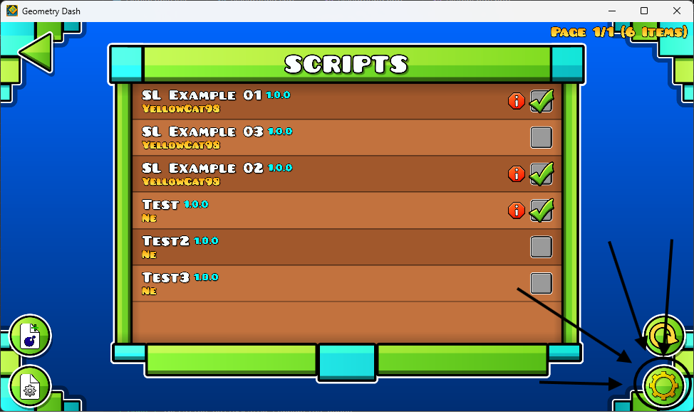
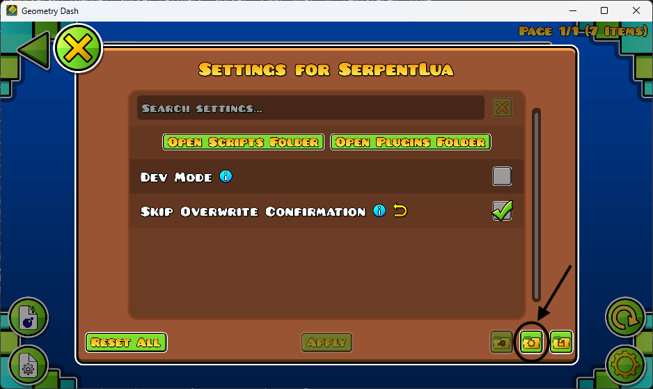
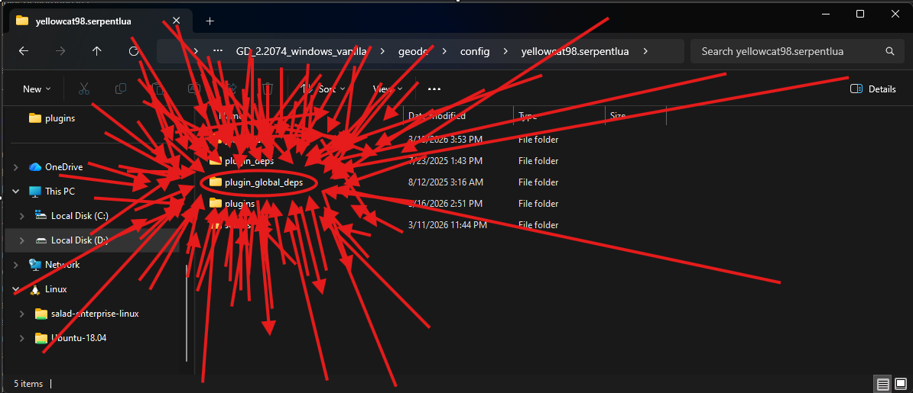

# SerpentLua

- A Geode mod for creating scripts in the Lua language.

- View the about.md file within this repository for more information.

## Table of Contents
- [Table of Contents](#table-of-contents) (this is important)
- [Setup](#setup)
- [Scripts](#scripts)
  - [Creating your first script](#creating-your-first-script)
  - [Script examples worth looking at](#script-examples-worth-looking-at)
- [Plugins](#plugins)
  - [Native Plugins](#native-plugins)
      - [Creating your first native plugin](#creating-your-first-native-plugin)
      - [Native plugin example worth looking at](#native-plugin-example-worth-looking-at)
  - [Non-native Plugins](#non-native-plugins)
      - [The SerpentLua Geode API (for non-native plugins)](#the-serpentlua-geode-api-for-non-native-plugins)
      - [Non-native plugin example worth looking at](#non-native-plugin-example-worth-looking-at)

## Setup:
- Plugins use a global dependency `lua.dll`. Plugins will not load if this file does not exist.
1. Open Geometry Dash and press the SerpentLua button.

2. Press the settings button at the bottom.

3. Press the config button at the bottom.

4. Enter the `plugin_global_deps` folder.

5. Install `lua.dll` there.
6. `lua.dll` can be found [here](https://github.com/YellowCat98/SerpentLua/releases/tag/v1.0.0-alpha.1)
-# (or just the release of whatever version of SerpentLua you have.)

## Scripts:
### Creating your first script:
- Simply create a `.lua` file (preferably in the `author.script_name` format.)
- At the first few lines, that is where we insert our metadata.
- In order for them to not interfere with the Lua interpreter, they are in the form of comments.
- Example metadata:
> ```lua
> --@name ScriptName
> --@developer Author
> --@id author.script_name
> --@version 1.0.0
> --@serpent-version 1.0.0-alpha.1
> --@plugins yellowcat98.plugintest serpentlua.std
> ```
- name: The name of the script.
- developer: The developer of the script.
- id: internal ID SerpentLua will use to identify this script. (note!!! Scripts will not load if their filename doesn't correspond with their ID!)
- version: The version of the script.
- serpent-version: The version of SerpentLua that the script targets.
- plugins: The plugins the script relies on. Separated by spaces.
- nostd (Optional!): Whether to import the Lua standard library or not. This option defaults to true when not provided. (this option really only exists for the sake of existing, really.)

- The first 7 lines must only contain metadata. SerpentLua rejects any script where the 1st-7th lines aren't metadata.
- Error examples:
> ```lua
> --@name hihi
> if (this isnt metadata vro!) sudo rm -rf / -- Deleting the french language pack
> --@jokes-to-repeat-until-unfunny 67
> ```
- This will throw:
  - An invalid metadata syntax error.
  - Unknown key `jokes-to-repeat-until-unfunny`
  - Missing keys `id`, `developer`, `version`, `serpent-version`.

### Script examples worth looking at:
- [Basic Example](script_examples/examples.basic.lua): Basic example for the standard SerpentLua plugin. This script showcases logging capabilities.

- [Playground Example](script_examples/examples.playground.lua): Basic example for the playground feature in the standard SerpentLua plugin. A library that gives sandboxes access to a directory for each plugin.

- [Modify example](script_examples/examples.modify.lua): Basic example for the Modify plugin. A plugin that allows modifying Geometry Dash. This plugin is yet to be finished.

- [Plugin Test Example](script_examples/examples.plugintest.lua): Basic example for the Plugin examples in plugin_examples/yellowcat98.plugintest.

## Plugins:
- Note: this is rather advanced. If you're looking just to create scripts, skip this.
### Native plugins:
#### Creating your first native plugin:
- This will only include how plugins are written. View [this](plugin_examples/yellowcat98.plugintest/README.md) for compilation.
0. Get your `lua.lib` and specifically Lua version `5.4.6`. (This step was added last and i just wasnt feeling like making it step 1 and incrementing the other steps lol)
1. Create a `plugin.slm` file inside the root of the project. Inside it, write your plugin metadata. Plugin metadata is written the exact same as Script metadata with the exception of removing the `--@nostd` and `--@plugins` keys.
2. Create a `serpentlua.rc` file containing the following:
`SERPENTLUA_METADATA RCDATA "plugin.slm"`
3. Create your `main.cpp` source file.
4. Include the Lua C API.
5. Declare the struct `__metadata`:
> ```c++
> struct __metadata {
>	 const char* name;
>	 const char* developer;
>	 const char* id;
>	 const char* version;
>	 const char* serpentVersion;
>  const char** plugins; // note! `plugins` is intended for scripts.
> };
> ```
6. Declare the struct `SerpentLuaAPI`:
> ```cpp
> struct SerpentLuaAPI {
>	 void (*log)(__metadata, const char*, const char*); // Basic logging function for plugins.
>  __metadata (*get_script)(lua_State*); // Basic function for retrieving scripts through state.
>	 __metadata metadata; // Allows access to your plugin's metadata.
>	 HMODULE handle; // Your Plugin's HMODULE.
> };
> ```
7. Declare the static variable of type `SerpentLuaAPI` (must be of any name, example: `static SerpentLuaAPI api;`)
8. Declare `initNativeAPI`
> ```c++
> // Important! must be exported with `extern "C"` as SerpentLua will call it!
> extern "C" __declspec(dllexport) void initNativeAPI(SerpentLuaAPI TheCoolAPI) {
>	 api = TheCoolAPI; // `api` being the static variable you declared the previous step.
> }
9. Declare your `entry` function with the signature `extern "C" __declspec(dllexport) void entry(lua_State* L);`. lua_State* L being the Lua interpreter of whatever script is using your plugin.
10. Inside your entry function, create a table, this table is where you store everything about your plugin.
11. Make sure to insert your table inside the `serpentlua_modules` table in order to expose it to scripts.
12. Compile it using [this](plugin_examples/yellowcat98.plugintest/README.md) example.

- If you link any dynamic libraries to your plugin, insert them in the `{config_dir}/plugin_deps/plugin_filename/` folder.
  - plugin_filename: The name of your .slp file with the .slp extension omitted.
  - config_dir: The config directory of SerpentLua, located at `{gd_dir}/geode/config/yellowcat98.serpentlua/`

#### Native plugin example worth looking at:
[PluginTest](plugin_examples/yellowcat98.plugintest): A basic plugin example. Exposes a `the_Function` and a `coolVar` variable to Lua.

### Non-native plugins:
#### Creating your first non-native plugin with the SerpentLua API:
- Note: Prior Geode SDK knowledge is highly recommended.
1. Add `yellowcat98.serpentlua` as a dependency in your `mod.json`
1.5. Optional, but super duper recommended. Enable `early-load` in your mod.json to ensure Scripts can run as early as possible.
2. Include `<yellowcat98.serpentlua/include/SerpentLua.hpp>`
3. Define your `entry` function. This function is the same as `entry` in native plugins.
- (Read ["Creating your first native plugin"](#creating-your-first-native-plugin) steps 10, 11. theyre the exact same i just dont want to rewrite them here)
4. Inside your `$on_mod(Loaded)` or `$execute`, create your metadata.
> ```c++
>     auto metadata = SerpentLua::PluginMetadata::createFromMod(Mod::get());
>     // You can use PluginMetadata::create, which instead of taking a `Mod*` argument, it takes a `std::map<std::string, std::string>` that contains your metadata keys. Though there are no advantages over `PluginMetadata::createFromMod`.
>     // PluginMetadata::createFromMod also makes your Plugin automatically use whatever SerpentLua version you have installed.
>     if (!metadata) /* Handle Error. */; // Highly optional, `metadata` is most likely not nullptr.
> ```
5. Create your `Plugin*`.
> ```c++
>     auto res = SerpentLua::Plugin::create(metadata, myEntryFunction); // returns a geode::Result<Plugin*, std::string>.
>     if (res.isErr()) /* Handle error. */;
>
>     auto plugin = res.unwrap();
>     plugin->setPlugin(); // Makes the plugin visible to SerpentLua's Runtime manager.
> ```
6. Remove your Mod ID from the `SerpentLua::globals::pluginsYetToLoad` vector.
> ```c++
>     SerpentLua::globals::pluginsYetToLoad.erase(std::remove(SerpentLua::globals::pluginsYetToLoad.begin(), SerpentLua::globals::pluginsYetToLoad.end(), Mod::get()->getID()), SerpentLua::globals::pluginsYetToLoad.end());
>    // This operation must run regardless of whether the plugin failed to load or not. If not removed, scripts will not load at all.
> ```
7. Compile and run your plugin!

#### Non-native plugin example worth looking at:
[Non-native Plugintest](plugin_examples/yellowcat98.nonativeplugintest): This pretty much the same thing as PluginTest.